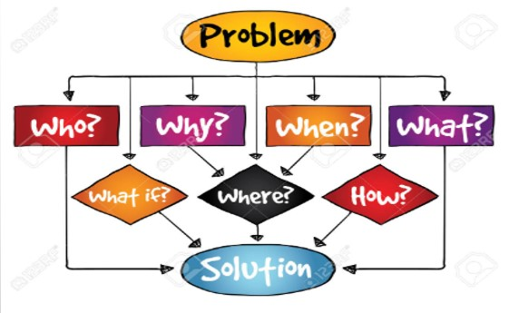
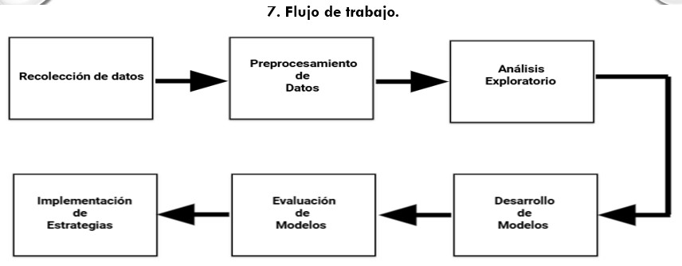

# Predicción de Rotación de Empleados en el Sector Financiero: Un Enfoque Basado en Machine Learning

## Tabla de Contenidos
- [Resumen](#resumen)
- [Introducción](#introducción)
- [Problema](#problema)
- [Propósito del Estudio](#propósito-del-estudio)
- [Dataset](#dataset)
  - [Variables Clave](#variables-clave)
- [Flujo de Trabajo](#flujo-de-trabajo)
- [Modelos Utilizados](#modelos-utilizados)
  - [Métricas de Evaluación](#métricas-de-evaluación)
- [Resultados](#resultados)
- [Conclusiones](#conclusiones)
- [Requerimientos](#requerimientos)

## Resumen
Este proyecto tiene como objetivo predecir la rotación de empleados en una empresa de servicios financieros utilizando modelos de **Machine Learning** como **Regresión Logística** y **Random Forest**. A través del análisis de datos históricos de empleados, se busca identificar patrones y factores críticos asociados al abandono laboral, permitiendo a la empresa implementar estrategias efectivas de retención y reducir la rotación en un 10% o más.

## Introducción
La rotación de empleados representa un desafío significativo para las empresas, especialmente en sectores altamente competitivos como los servicios financieros. Los costos asociados a la alta rotación incluyen:
- Reclutamiento y capacitación.
- Pérdida de experiencia organizacional.
- Disminución en la productividad y la moral de los empleados restantes.

Este proyecto utiliza datos históricos para identificar factores que contribuyen al abandono laboral, predecir los empleados con mayor riesgo y proponer estrategias de retención basadas en los resultados.

## Problema
En los últimos dos años, la empresa ha enfrentado un aumento considerable en la rotación de empleados, lo que ha generado:
- Altos costos operativos.
- Impacto negativo en la cultura organizacional.
- Incremento en la carga laboral y disminución de la moral de los empleados restantes.

El objetivo es identificar los factores más relevantes asociados a la rotación y predecir qué empleados tienen mayor probabilidad de abandonar la empresa.

## Propósito del Estudio
Desarrollar un modelo predictivo que permita identificar empleados con mayor riesgo de abandono laboral, lo que permitirá implementar estrategias personalizadas de retención, como:
- Programas de desarrollo profesional.
- Revisiones salariales.
- Mejoras en la experiencia laboral.

El objetivo es ayudar a la empresa a reducir la rotación al identificar patrones en el comportamiento de los empleados que puedan predecir quiénes están en riesgo de renunciar.
De este modo, el proyecto busca proporcionar un valor medible a la empresa a través de una disminución de costos operativos y una mejora en la satisfacción y estabilidad de su fuerza laboral.
Se va a desarrollar código en Python para la predicción de rotación, se emplearán dos modelos: regresión logística para analizar la relación entre las variables y la probabilidad de rotación, y bosques aleatorios (Random Forests) para evaluar la importancia de diferentes factores y mejorar la precisión del modelo. Los modelos se evaluarán mediante métricas como precisión, sensibilidad y especificidad, permitiendo ajustes y optimización.

## Dataset
El proyecto utiliza el archivo **"Employee Attrition Data.csv"**, disponible en Kaggle ([Dataset Link](https://www.kaggle.com/datasets/stealthtechnologies/employee-attrition-dataset?resource=download)).

### Variables Clave
- **Edad (Age):** Información sobre las etapas de vida y permanencia laboral.
- **Genero (Gender):**
- **Ingreso Mensual (Monthly Income):** Impacto del salario en la retención.
- **Satisfacción en el Trabajo (Job Satisfaction):** Indicador del nivel de compromiso.
- **Horas Extraordinarias (Overtime):** Relación con la carga laboral y el abandono.
- **Antigüedad (Years at Company):** Impacto del tiempo en la empresa.
- **Estado Civil, Nivel Educativo, Dependientes, etc.:** Factores adicionales relevantes.

### Hipótesis

Factores como el salario mensual, la antigüedad en la empresa, el equilibrio trabajo-vida y la satisfacción laboral son determinantes clave para predecir la rotación de empleados.



## Flujo de Trabajo
1. **Recolección de Datos:** Importación y limpieza del dataset.
2. **Preprocesamiento:** Codificación de variables categóricas y transformación de datos.
3. **Análisis Exploratorio (EDA):** Identificación de patrones y relaciones clave.
4. **Desarrollo de Modelos:** Desarrollo de **Regresión Logística** y **Random Forest**.
5. **Evaluación de Modelos:** Uso de métricas como precisión y curva ROC-AUC.
6. **Implementación de Estrategias:** Identificación de empleados en riesgo y diseño de estrategias de retención.


### 


### Mapeo del Sistema
El sistema se estructura en un módulo de predicción, que recibe los datos de los empleados y predice la probabilidad de rotación, y un módulo de visualización, que presenta los resultados de manera comprensible para los gerentes de recursos humanos.


## Modelos Utilizados
- **Regresión Logística:** Proporciona interpretabilidad y permite analizar la relación entre variables predictoras y rotación.
- **Random Forest:** Modelo de ensamble que mejora la precisión y resalta la importancia de las características clave.

### Métricas de Evaluación
- **Precisión:** 70.3% (Regresión Logística) y 74.5% (Random Forest).
- **ROC-AUC:** 0.76 (Random Forest), reflejando una capacidad moderada para distinguir entre abandono y no abandono.

## Resultados
1. **Factores Críticos Identificados:**
   - Satisfacción Laboral: Principal factor asociado al abandono.
   - Horas Extraordinarias: Impacto significativo en el riesgo de abandono.
   - Ingreso Mensual: Los niveles bajos aumentan el riesgo.
2. **Comparación de Modelos:**
   - Random Forest superó a la Regresión Logística en precisión.
   - La Regresión Logística ofrece interpretabilidad de las relaciones.

## Conclusiones
- Mejorar la **satisfacción laboral** es clave para reducir la rotación.
- Revisar las políticas de **cargas laborales** y horas extras.
- Diseñar esquemas salariales competitivos para retener talento.
- Focalizar estrategias en los departamentos con mayor riesgo.

## Requerimientos
Para ejecutar este proyecto, necesitas las siguientes bibliotecas en Python:
```bash
pip install pandas numpy scikit-learn matplotlib seaborn

